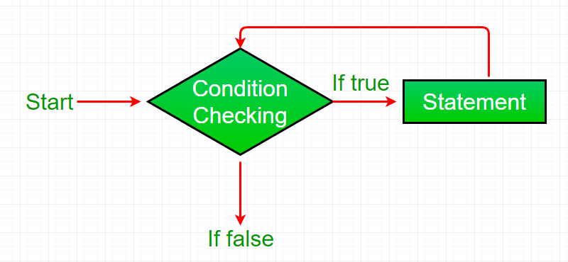

 # Read: 02 - Arrays, Loops, Imports

 - developers can combine groups of classes using **Packages**. it contains all the java files.  first, you need to declare the package. 
 there is a default package that provides the fundamental classes that are necessary to make a basic Java app. 
 
        (( java. lang package))

 after the package declaration, you can **import** these three options: 
 -  import javax.swing.*; it can read all classes but only work with one.

 - import javax.swing.JOptionPane;  when using this import,only one class is visible 

 - No import needed.

 there are many common imports as well and here are 3 of them from https://perso.ensta-paris.fr/:
 
 import java.awt.*;   this one imports everything at one time.
 import java.awt.event.*; Provides classes to dealing with different types of components.
 import javax.swing.*;      More common GUI elements. Note "javax".

 
 --------------------------------
  some fun facts: 
   - having imported classes inside one package does not make the file larger.
   - there is no difference if you imported all classes or the classes needed.
 -------------------------------

  **looping** means to make a feature run until it finally evaluates to false (end of condition) which means that one opperation will work on until it reaches the end of the elements: 

   

   (image from geeksforgeeks)

  in Java there are 4 types of loops: 

 -  for loop:
it is the simplest loop of all, it allows developers to repeat operations over items when the number of trials (when the developer knows how many times it should run).

 -  for-each loop:
from the first look, for each loop looks like a normal for loop, but it works by declaring a value initialized with the data type of it(String star = starrs[i]).
 - While loop:
 the while loop repeats a statement or operation non-stop until the condition evaluates to true so the developer should know when to use it because it may cause an infinite loop.
 - Do-While loop:
 it's like the while loop but with an additional condition that happens after the first condition.

