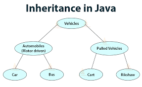

## Inheritance: 
if you want to make a new class but you already have one that contains all the features that you want, why don't you use the same class then. it is a tool (way) that you can use in java and it's called inheritance. classes in object-oriented programming languages like java are allowed to inherit some common features that are shared with other classes. and also have some unique features. this is what's called inheritance.

Every time we use packages, we are using inheritance. and object is the general one of all.  to allow a class to inherit from other subclasses, use the word extends followed by the class name. in this way the class will take all the features in the subclass and also can have ones for its own. So basically, we need to write a general class that holds the methods and the constructor, and then use it in other objects using the word extends. and don't forget that the parent class allows the child to inherit everything it has.


 

 // this photo is from Techvidvan.


## Interfaces: 
- interfaces in java are more like a class that has static constants and abstract methods. it is like blueprints for methods. This way is used to detect and to know methods behaviors. also, it is interesting to mention that all methods will appear if it is defined in the interface used in a class. 


Syntax: 
to use an interface we use interface keywords :
public class interface NNNN {interface body }, the code ends with a semicolon (;), but no braces are used inside the interface body.
On the off chance that you need to be able to compare the estimate of comparable objects, no matter what they are, the class that instantiates them is  Relatable that can be used in any class.

for Example (this example is from oracle website):
``` java
public Object findLargest(Object object1, Object object2) {
   Relatable obj1 = (Relatable)object1;
   Relatable obj2 = (Relatable)object2;
   if ((obj1).isLargerThan(obj2) > 0)
      return object1;
   else 
      return object2;
}
```

 


 // photo from javatpoint.
