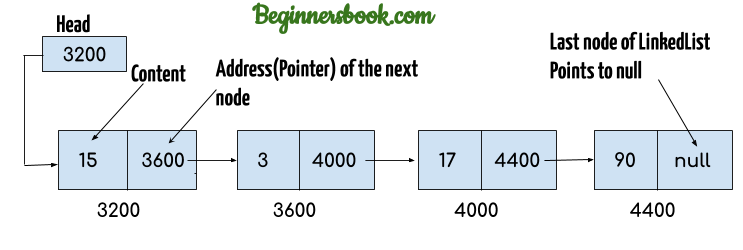
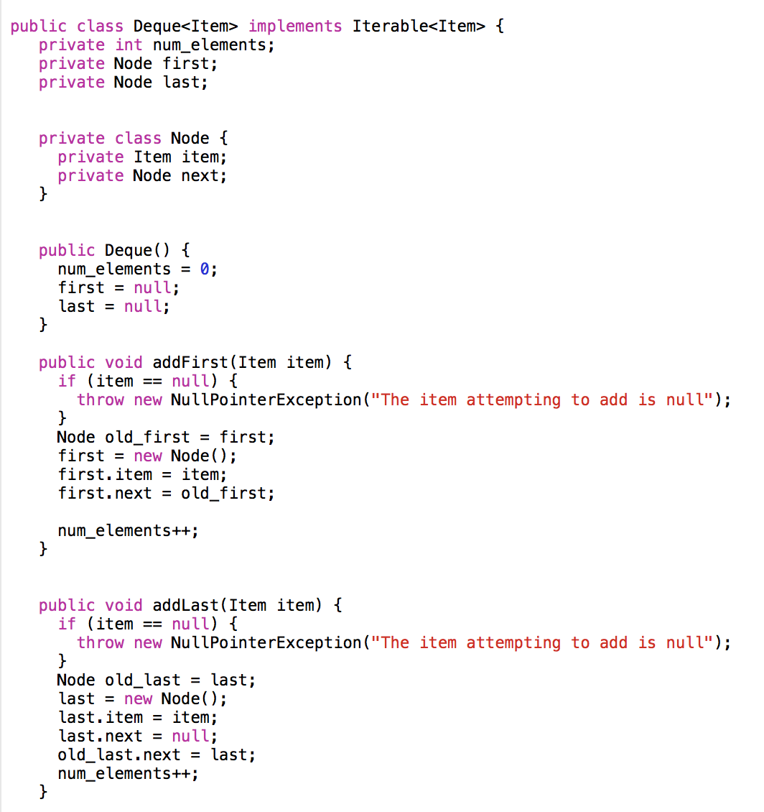

# Linked Lists:

what is a ***linked lists***? it is a data structure and collection/series of nodes that each on of it is connected to the one beside it. it is also considered as linear data structures, that means it works is sequence (in order).
 we can say linked lists and arrays are similar in a way or another, but in one aspect whick is that the order of itmes matters alot. But the defference betweet them is the way they hold data in memory, arrays takes bytes allocated in one place while linked lists will allocate them in deffirent places in the PC. it is interesting that in linked lists we have the terms singly and doubly  but what does it really mean? it is the types of linked lists, Singly means that all nodes have one reference. on the other hand Doubly means that it have reference to the previous nodes and the next nodes.

 to loop over a linked list we cannot use foreach loop, because linkedd lists runs in a sequence that cannot be broken. instead of for loops we work with th values given from the **Next** which tell us where is the next node. a **While** loop can solve this problem for us, so developers always use while loops with linked lists.
 the linked lists first Node is called ***head*** but what is a node anyway? it is similar to the index in arrays, which is the items in it. so nodes are the items of the lists, each node in the linked lists are connected with the next one beside it. which explais why the sequence and the order of items is so important to it. and the last value in the sequence will be null as the following drawing.

 

 Q- what is the ***BigO*** Notation for the linked lists codes?
  the bigO  is a way to calculate and manage time and space complexities in each function, it depends on 4 things: the size of the input, Units of Measurement, Orders of Growth, and Best Case, Worst Case, and Average Cases. for linked lists it is O(n) in the worse case for the time complexity, and O(1) for the space complexity.

- there are some ways to add items (Nodes) to the linked lists:
     - we can add to the first item.
     - we can add after the last item.
     - we can add before or after a specific item.
     the following code shows how to add first and last nodes.

 

