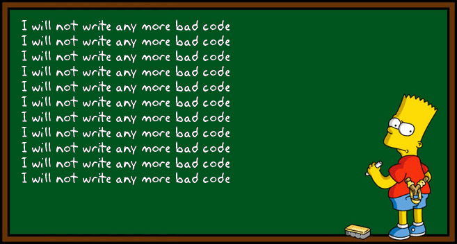

# Read: 08 - OO Design
 In software development world, you need to be fast, clever, and creative. and a good programmer should make a working code in the simplest way. these principles will help you to do so: 

## Dry  principle:
developers tend to avoid repeating themselves, and they do not like repeating the same opperations thet do the same job. So  Andy Hunt and Dave Thomas descovered this principle that every developer should have. which is : "Don't repeat yourself" or (DRY). and abstraction is the way to avoid duplication and Repetition. 
during softwaredeveloping every developer may face this problem, which is writing the same things twice (WET) that satnds for writing everything twice. we can prevent this Using frameworks that minimize or eliminate all but the most necessary editing processes, leaving the extensibility of adding new knowledge variables in one location.

 (AHA )is the shorthand for "Avoid Hasty Abstractions", which is another approach to abstractions
  

instead of repeating yourself try this :

## Rule of three:
*** once you wrote the same code 3 times you should think to refactor it ***
is a rulethat shows whether comparable sections of code should be refactored to reduce repetition in code restructuring. It suggests that while two examples of similar code do not require refactoring, three instances of similar code should be extracted into a separate process.
and it is okey if you wrote the same code twice, but three times is too much and you should start thinking of refactoring it.

## YAGNI principle :
***"You aren't gonna need it"***

the yangi principle is too easy, which states that the good programmer should only add more functions when it is necessary. so the good programmer should only write code that is short and only when it is required. (DTSTTCPW) stands for  "do the simplest thing that could possibly work" that helps the developers to stay motivated for work and also creative, they will be always trying to invent ways of doing things whick will help their mindset to be always awake.

  

## MVP principle: 
MVP stands for ***A minimum viable product***  which indecates the following: it is the program with minimum working features to provide the customers so he can add some ideas and feedback to it. this principle prevent the programmer of wasting time on making features that the customer may not like or won't be interested in, instead the programmer makes a working program that has important features and wait for the feedback to edit and do some other stuff related to the customers needs. 

 
