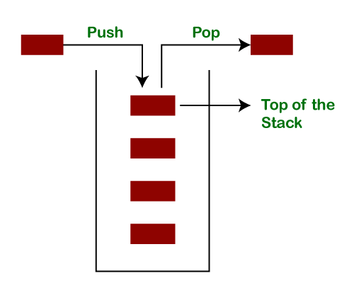

## Read: Stacks & Queue.

After taking the Linked List. we will take the Stack which is the second ***data structure*** we are going to learn. a **Stack** is very similar to the linked list in away or another. because it has ***Nodes***, which is the elements of it. each Node has connection to the one beside it. BESIDE here means the Node that follows it not the previous one. 

there are some terms that we should be familiar with when dealing with Stack:

| term  | meaning |
| ----------- | ----------- |
| Push |  Pushing Nodes to an item. |
|Pop|Removing  Nodes or items from the stack.|
|Top| the top of the stack.|
|Peek|viewing the value of the top Node in the stack.|
|IsEmpty|returns true when stack is empty.|

  

- and also, there are some **rules** in the Stack which are:

First In Last Out or ***(FILO)***:the first item added in the stack is the last item removed from the stack.
**And the opposite ...** 
Last In First Out ***(LIFO)*** : The last one added will be the first one to be removed.
So When you push (Add) to the stack, the item added becomes the top of the stack. and when you pop(remove/delete) item from the stack, you remove the current top whick makes the top is the top.next.
For the ***BigO***
-   **Pushing** will always be an O(1).
-   **Poping** or removing Items will be O(1).
-   checkoing if the stack is empty **IsEmpty** will be an O(1).
<>
--------------------------

## The Queue :
 It is a data structure in Java that holdes elements in a FIFO (First In, First Out) order.

there are some terms that we should be familiar with when dealing with queues:

| term  | meaning |
| ----------- | ----------- |
| Enqueue |  adding Nodes to the queue. |
|Dequeue|Removing  Nodes or items from the queue.|
|Front| first Node of the queue.|
|Rear|last Node of the queue.|
|Peek|view the value of the front Node|
|IsEmpty|returns true when queue is empty.|

  
<>
--------------------
Fun fact:
If Fifo stands for (First In, First Out) then Last in last out's shorthand is (Lilo) ^.^

***For the BigO:***
Enqueue O(1)
Dequeue O(1)
Peek O(1)
IsEmpty O(1)

